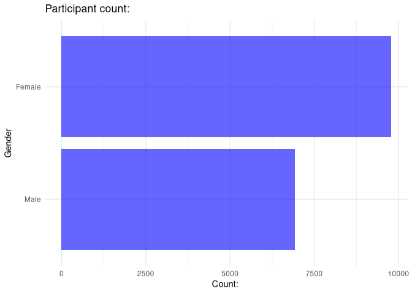
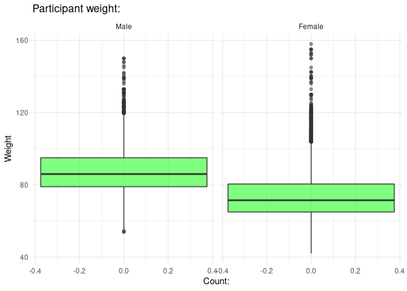
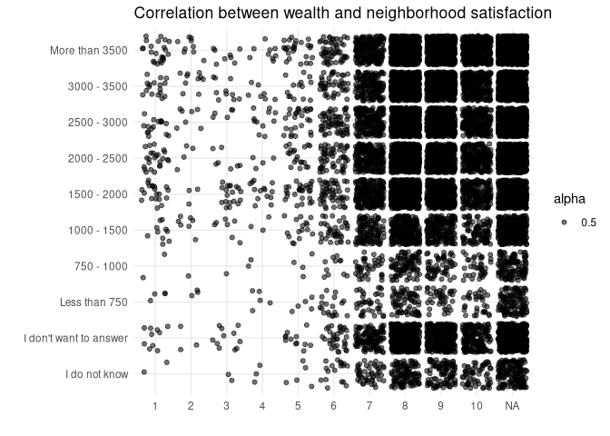

<!-- README.md is generated from README.Rmd. Please edit that file -->

# LifelinesDataDashboard

> Date: 5-01-2025

<!-- badges: start -->
<!-- badges: end -->

The goal of the package LifelinesDataDashboard is to visualize the
Lifelines dataset and to show the significance of correlations between
gender, age, income and many more. This dashboard has interactive
functionality to make visualizations based on filters of you own
choosing, like age and gender.

## Installation

You can install the development version of LifelinesDataDashboard from
[GitHub](https://github.com/) with:

``` r
# First install het pak library:
install.packages("pak")

# Then, use pak to install the package from github:
pak::pak("Fl-ris/Lifelines_data_dashboard")
```

## Example

The code snippets below demonstrate some of the functionality of the
LifelinesDataDashboard package.

First, load the library.

``` r
library(LifelinesDataDashboard)
```

After that, load the dataset with the function: `run_datadashboard()`
and give the path the the dataset as shown in the following example:

``` r

#run_datadashboard(here("Data", "Lifelines Public Health dataset - 2024.csv"))

load_dataset(here("Data", "Lifelines Public Health dataset - 2024.csv"))
```

The plotting functions can also be called upon without the shiny
interface:

``` r

gender_dist(dataset = lifelines_df)
```



``` r
weight_dist(dataset = lifelines_df)
```



``` r
finance_neighborhood_cor(dataset = lifelines_df)
```



**Dependencies:**  
Dependencies for the LifelinesDataDashboard library:  
- R (\>= 3.5.0)  
- pak  
- Other libraries will be automatically installed with
‘pak(“Fl-ris/Lifelines_data_dashboard”)’  

Dependencies for the Notebook with my analysis:  
- R  
- tidyverse  
- stringr  

**Author:** F.J.A. Menninga, github name: fl-ris
